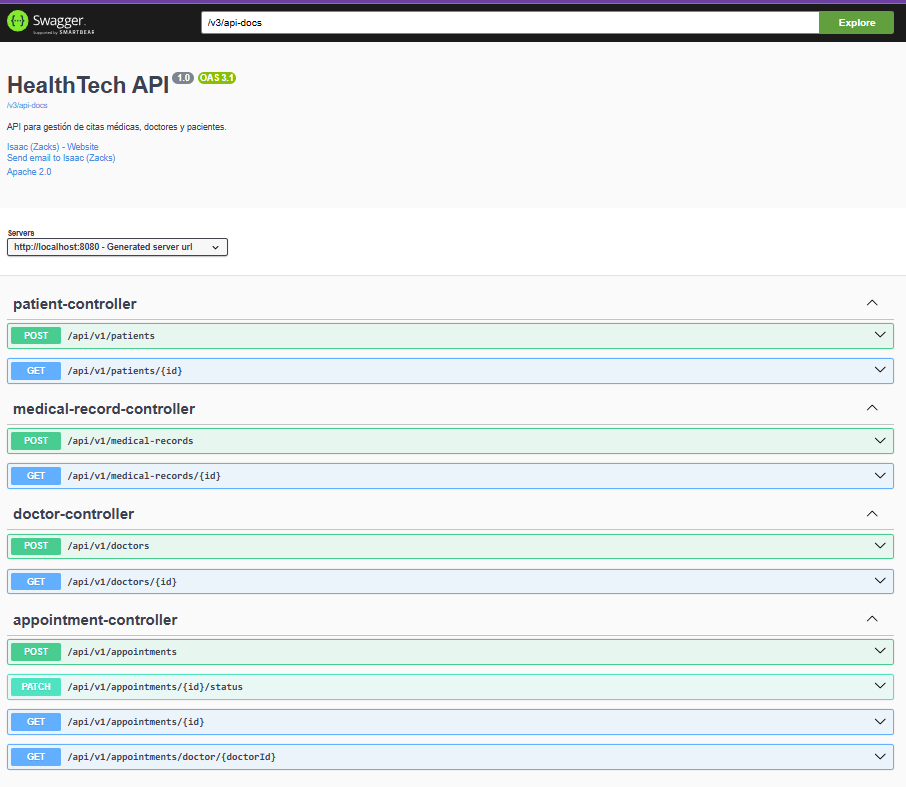
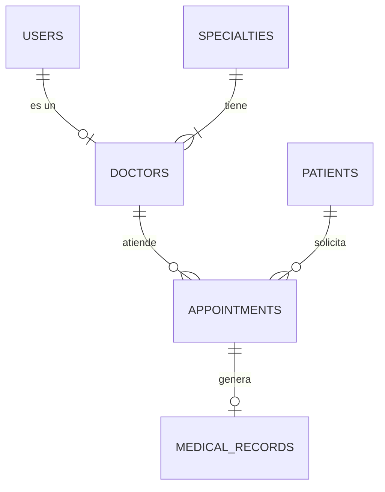

# 🏥 HealthTech API - Sistema de Gestión de Citas Médicas


> API RESTful robusta para la administración de clínicas, doctores, pacientes y agendamiento de citas. Diseñada con **Arquitectura Hexagonal**, principios **SOLID** y escalabilidad en mente.

---

## 📋 Características Principales

* **Gestión Integral:** CRUD completo para Doctores, Pacientes y Especialidades.
* **Agendamiento Inteligente:** Sistema de reservas con validación de conflictos de horario (evita *overbooking*) y manejo de estados.
* **Alto Rendimiento:** Implementación de **Paginación y Ordenamiento** (`Pageable`) para consultas masivas.
* **Calidad de Software:** Lógica de negocio blindada con **Tests Unitarios** (JUnit 5 + Mockito).
* **Historial Clínico:** Creación de diagnósticos vinculados automáticamente al completar citas.
* **Seguridad:** Encriptación de contraseñas con BCrypt y Spring Security.
* **Infraestructura:** Despliegue agnóstico contenerizado con Docker y Docker Compose.

---

## 🛠️ Stack Tecnológico

* **Lenguaje:** Java 17
* **Framework:** Spring Boot 3
* **Base de Datos:** PostgreSQL
* **ORM:** Hibernate / JPA
* **Mappers:** MapStruct (Entidad <-> DTO)
* **Testing:** JUnit 5, Mockito
* **Documentación:** SpringDoc (Swagger UI)
* **DevOps:** Docker, Docker Compose

---

## 🚀 Instalación y Ejecución

### Opción A: Ejecución Rápida con Docker (Recomendada)
Si tienes Docker instalado, no necesitas configurar nada más.

1.  Clona el repositorio:
    ```bash
    git clone [https://github.com/TU_USUARIO/HealthTech.git](https://github.com/TU_USUARIO/HealthTech.git)
    cd HealthTech
    ```
2.  Ejecuta el entorno completo:
    ```bash
    docker-compose up --build
    ```
3.  La API estará disponible en `http://localhost:8080`.

### Opción B: Ejecución Manual
Requisitos: Java 17 SDK, Maven, PostgreSQL local.

1.  Configura tus variables de entorno en un archivo `.env` o en `application.properties`:
    ```properties
    DB_URL=jdbc:postgresql://localhost:5432/HealthTechDb
    DB_USERNAME=tu_usuario
    DB_PASSWORD=tu_password
    ```
2.  Compila y ejecuta:
    ```bash
    mvn clean install
    mvn spring-boot:run
    ```

---

## 🧪 Ejecución de Pruebas (Testing)

El proyecto cuenta con una suite de pruebas unitarias para garantizar la integridad de las reglas de negocio (ej: no permitir citas duplicadas).

Para ejecutar los tests:
```bash
mvn test
```

---

## Documentación de la API

Una vez levantada la aplicación, accede a la documentación interactiva:

👉 **[http://localhost:8080/swagger-ui.html](http://localhost:8080/swagger-ui.html)**

*(Aquí puedes pegar tu captura de pantalla de Swagger)*


---

## Arquitectura de Base de Datos

El sistema utiliza un modelo relacional normalizado para garantizar la integridad de los datos médicos.



---

## Ejemplos de Uso

### Crear un Doctor

```http
POST /api/v1/doctors
Content-Type: application/json

{
  "userId": null,
  "specialityId": "uuid-de-especialidad",
  "name": "Gregory",
  "lastName": "House",
  "license": "CMP-99999",
  "consultingRoom": "301"
}
```

### Crear una Cita

```http
POST /api/v1/appointments
Content-Type: application/json

{
  "doctorId": "uuid-del-doctor",
  "patientId": "uuid-del-paciente",
  "scheduledAt": "2025-12-01T09:00:00",
  "reason": "Consulta General"
}
```

## Autor

Isaac - Prueba Técnica Supermercado

## Licencia

Este proyecto es de uso educativo y de demostración.